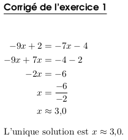

.. _ecrire:

===================================
Tutoriel : Créer un nouvel exercice
===================================

Cette article décrit la procédure pour créer un nouvel exercice pour Pyromaths. Nous prendrons comme exemple la création d'un exercice de résolution d'équations du premier degré du type :math:`ax+b=cx+d` où les nombres :math:`a`, :math:`b`, :math:`c`, :math:`d` sont des entiers relatifs.

.. note::

   Certains termes techniques anglais
   (comme `template`, `merge`, etc.)
   n'ont volontairement pas été traduits.
   Cette documentation renvoit à d'autres documentation en anglais,
   et pour que la personne lisant ces lignes s'y retrouve d'une documentation à l'autre,
   nous avons fait le choix de conserver les termes anglais plutôt que d'utiliser leur équivalent français.

.. note::

   Cette documentation a été écrite en se mettant à la place d'une personne utilisant GNU/Linux.
   Il est également possible d'écrire un nouvel exercice depusi Windows ou MacOS,
   mais certaines commandes décrites dans ce document changent un peu.
   À vous de les adapter.

.. contents::
   :local:
   :depth: 1

Préambule
=========

Les personnes pressées peuvent jeter un œil à deux exercices implémentés dans Pyromaths :

- un exemple simple (avec très peu de cas particuliers) : la recherche d'état stable.

    - :download:`code Python <../../src/pyromaths/ex/lycee/matrices.py>`
    - :download:`template de l'énoncé <../../data/ex/templates/EtatStableSysteme2-statement.tex>`
    - :download:`template de la solution <../../data/ex/templates/EtatStableSysteme2-answer.tex>`

- un exemple plus complexe (avec cas particuliers) : bilan sur les polynômes du second degré en seconde.

    - :download:`code Python <../../src/pyromaths/ex/lycee/SecondDegre.py>` ;
    - :download:`template de l'énoncé <../../data/ex/templates/BilanTrinomeSansDiscriminant-statement.tex>` ;
    - :download:`template de la solution <../../data/ex/templates/BilanTrinomeSansDiscriminant-answer.tex>`.

Prérequis
=========

Loi
---

Pyromaths est publié sous licence publique GNU version 3 (`GPLv3 <https://fr.wikipedia.org/wiki/Licence_publique_g%C3%A9n%C3%A9rale_GNU>`__). Si vous souhaitez contribuer à Pyromaths en partageant votre exercice, celui-ci devra impérativement être également publié sous cette même licence.

Connaissances
-------------

Créer un exercice pour Pyromaths nécessite de savoir utiliser un minimum :

- :math:`LaTeX` ;
- Python (version 3) ;
- git.

Une connaissance de la bibliothèque Python `jinja2 <http://jinja2.pocoo.org>`__ est un plus, mais les bases s'apprennent rapidement et sont décrites plus loins dans ce document.

Outils
------

À part `git <http://git-scm.com>`__, tous les outils nécessaires pour créer un exercice sont des dépendances de Pyromaths. `Installez <http://www.pyromaths.org/installer/>`__, et faites fonctionner Pyromath : les outils nécessaires pour ce tutoriel seront alors disponibles.

Environnement de travail
========================

Commençons par télécharger les sources de Pyromaths, en utilisant le logiciel `git`. Si vous avez un compte `Github <http://github.com>`__, utilisez :

.. code-block:: shell

   $ git clone git@github.com:Pyromaths/pyromaths.git

Si vous n'avez pas de tel compte, utilisez :

.. code-block:: shell

   $ git clone https://github.com/Pyromaths/pyromaths.git

Puis déplacez vous dans le répertoire `pyromaths` ainsi créé. À partir de maintenant, sauf mention contraire, toutes les commandes sont à exécuter depuis ce répertoire.

La version de développement de Pyromaths se trouve dans la branche `develop` :

.. code-block:: shell

   $ git checkout develop

Il sera plus confortable, pour vous comme pour nous, que vous travailliez dans une branche séparée, par exemple `EquationPremierDegre` :

.. code-block:: shell

   $ git branch EquationPremierDegre
   $ git checkout EquationPremierDegre

Brouillon
=========

La première étape est d'écrire un exercice en :math:`LaTeX`, sans passer par Python, sans aléa : juste pour observer le rendu final. Utilisez l'outil :ref:`pyromaths-cli.py <pyromaths-cli>`.

.. code-block:: shell

   $ utils/pyromaths-cli.py dummy

Cette commande a pour effet de créer un modèle d'exercice, sous la forme d'un PDF qui est affiché à l'écran, et d'un fichier :math:`LaTeX` :file:`exercices.tex`.

Déplacez ce fichier dans un répertoire temporaire, et modifiez-le pour écrire le sujet de votre énoncé, à la place de ``ÉNONCÉ DE L'EXERCICE`` et ``CORRIGÉ DE L'EXERCICE``. Ne vous souciez pas de la manière dont cela sera intégré à Pyromaths ; ne vous souciez pas de la manière dont l'aléa sera intégré : nous verrons cela plus tard. C'est l'occasion de travailler la formulation de l'énoncé et de la solution pour qu'ils soient le plus clair possible.

Ne modifiez que les lignes qui correspondent à l'énoncé ou au corrigé. En particulier, ne modifiez pas le préambule.

Ce fichier doit être compilé avec ``latex``, puis converti en pdf avec ``dvipdf``. À la fin de cette étape, nous obtenons l'énoncé suivant (:download:`tex <ecrire/1/exercices.tex>`, :download:`pdf <ecrire/1/exercices.pdf>`).

.. literalinclude::  ecrire/1/exercices.tex
   :language: latex
   :linenos:
   :lineno-start: 115
   :lines: 115-146

Première version (sans aléa)
============================

Nous allons maintenant intégrer cet exercice à Pyromaths, sans aléa pour le moment.

Choisissez un identifiant pour votre exercice : un nom composé uniquement de lettres sans accents et de chiffres, sans espaces, comme `ConversionDegresRadians`, `TheoremeDePythagore`, `CoordonneesDuMilieu`, etc. Pour notre exemple, nous choissons `EquationPremierDegre` (qui sera décliné en `EquationPremierDegre2`, `EquationPremierDegre3`, etc. au fil de ce tutoriel).

Code Python
-----------

Le code Python de l'exercice doit être placé dans un des sous-dossiers de ``src/pyromaths/ex/``. Dans notre cas, ce sera ``src/pyromaths/ex/troisiemes``. Ensuite, modifiez un des fichiers `.py` déjà existant, ou créez-en un nouveau. Gardez une certaine logique : un exercice sur Pythagore a sa place dans le même fichier qu'un autre exercice sur Pythagore ; un exercice de trigonométrie n'a pas sa place dans un fichier ``matrices.py``. Dans notre cas, nous crréons un nouveau fichier contenant le code suivant.

.. literalinclude:: ecrire/2/equation2.py
   :linenos:

Modifiez les parties suivantes :

- ligne 8 : votre nom, et l'année courante ;
- ligne 29 : l'identifiant de l'exercice ;
- ligne 31 : la description de l'exercice ;
- ligne 32 : le niveau de l'exercice (le nombre avant le point sert à trier les niveaux ; celui après le point est le texte qui sera visible à l'utilisateur).

Code :math:`LaTeX`
------------------

Le code :math:`LaTeX`, quant à lui, doit être placé dans le répertoire ``data/ex/templates``, dans deux fichiers au nom de votre exercices. Reprenez votre fichier :download:`exercices.tex <ecrire/1/exercices.tex>`, et extrayez les lignes correspondant à l'énoncé, que vous écrivez dans le fichier :download:`EquationPremierDegre2-statement.tex <ecrire/2/EquationPremierDegre2-statement.tex>`, et celles correspondant au corrigé dans le fichier :download:`EquationPremierDegre2-answer.tex <ecrire/2/EquationPremierDegre2-answer.tex>`.

L'énoncé est alors dans le fichier :download:`EquationPremierDegre2-statement.tex <ecrire/2/EquationPremierDegre2-statement.tex>`.

.. literalinclude:: ecrire/2/EquationPremierDegre2-statement.tex
   :language: latex
   :linenos:

Le corrigé est dans le fichier :download:`EquationPremierDegre2-answer.tex <ecrire/2/EquationPremierDegre2-answer.tex>`

.. literalinclude:: ecrire/2/EquationPremierDegre2-answer.tex
   :language: latex
   :linenos:

Génération de l'exercice
------------------------

Vous pouvez maintenant tester la génération de votre exercice, en exécutant la commande suivante.

.. code-block:: shell

   $ utils/pyromaths-cli.py generate EquationPremierDegre2

Vous obtenez alors le fichier :download:`exercice.pdf <ecrire/2/exercice.pdf>`.

Bilan
-----

Nous avons écrit notre premier exercice, qui est intégré à Pyromaths. Par contre, il n'y a pas d'aléa : les valeurs numériques sont toujours les mêmes. Cela sera résolu dans la partie suivante.

Ajout du hasard
===============

Dans cette partie, pour générer l'exercice et suivre votre travail, la commande à utiliser est la suivante.

.. code-block:: shell

   $ utils/pyromaths-cli.py generate EquationPremierDegre3:2

Remarquez que par rapport à la commande utilisée dans la partie précédente, un ``:2`` a été ajouté à la fin de la ligne. Il correspond à la graine (`seed`) du générateur pseudo-aléatoire.

.. note::

  Un ordinateur ne sait pas générer du hasard. Il faut ruser.

  Dans notre exercice, nous avons besoin de nombres entiers entre 0 et 9. Pour avoir des nombres aléatoires, à chaque fois que nous utilisons un nombre aléatoire, nous prenons une décimale de π : d'abord `1`, puis `4`, puis `1`, puis `5`, et ainsi de suite. Cela à l'aire aléatoire à première vue, mais deux exécutions successives donneront exactement le même exercice. Améliorons cela.

  Nous gardons le même système, mais au lieu de commencer à la première décimale de π, nous utilisons désormais sur l'heure courante : si le programme est lancé à 13h37, nous utilisons alors les décimales de π à partir de la 1337e. Ainsi, deux exécutions successives donneront deux exercices différents.

  C'est mieux. Mais quand nous créerons notre exercices, nous allons générer encore et encore un exercice, et nous aimerions toujours générer le même (cela facilitera le développement, pour ne pas être perturbé par des valeurs numériques qui changent ; pour qu'un bug introduit par une valeur numérique spécifique n'apparaisse et ne disparaisse pas aléatoirement). Du coup, nous imposons le début de la séquence aléatoire : c'est la signification du ``:2`` ajouté à la fin de la ligne de commande.

  C'est un peu plus compliqué en réalité, mais dans les grande lignes, c'est ainsi qu'un ordinateur génère du hasard. Plus d'informations, par exemple, dans l'article de Wikipédia `Pseudorandom generator <https://en.wikipedia.org/wiki/Pseudorandom_generator>`__.

Si nous voulons générer un autre exercice, il suffit de transformer le ``EquationPremierDegre3:2`` en ``EquationPremierDegre3:1729``, ``EquationPremierDegre3:0123456789``, ou n'importe quel nombre de votre choix.

Code Python
-----------

Du côté de Python, il faut tirer au hasard quatre nombres entiers entre -10 et 10 (sauf 0 et 1, qui sont des cas particuliers), et les rendre disponible depuis le code :math:`LaTeX`. Cela se fait avec le contexte. Toutes les variables présentes dans ce dictionnaire seront accessibles depuis le `template` jinja2.

.. literalinclude::  ecrire/3/equation3.py
   :linenos:
   :lineno-start: 27
   :lines: 27-44

Code :math:`LaTeX`
------------------

Du côté de :math:`LaTeX`, nous allons profiter de la bibliothèque jinja2 pour utiliser les variables rendues disponibles dans le contexte.

.. note::

   Cette note se veut une courte introduction à Jinja2. Pour aller plus loins, rendez-vous sur `le site du projet <http://jinja.pocoo.org/docs/2.10/templates/>`__.

   Un template jinja2 est du code :math:`LaTeX` qui sera reproduit tel quel dans le document final, sauf que :

   - les variables peuvent être évaluées avec des doubles parenthèses. Pour insérer la valeur de la variable ``a`` du contexte, il faut utiliser ``(( a ))`` ;
   - des structures de contrôle (condition, boucle) peuvent être utilisées entourées par ``(*`` et ``*)``.

   Notons que les chaînes définissant ces blocs ont été modifiées par rapport aux chaînes initiales, car trop proches de la syntaxe :math:`LaTeX`. Ceci est documenté sur `le site officiel <http://jinja.pocoo.org/docs/2.10/api/#jinja2.Environment>`__, et mis en œuvre dans la classe :class:`pyromaths.ex.Jinja2Exercise`.

   .. literalinclude:: ../../src/pyromaths/ex/__init__.py
      :linenos:
      :lineno-start: 200
      :lines: 200-215

L'énoncé est assez simple : il suffit de faire appel aux variables du contexte.

.. literalinclude::  ecrire/3/EquationPremierDegre3-statement.tex
   :language: latex
   :linenos:

Dans ce code, ``(( a ))`` et ``(( c ))`` sont remplacés par les valeurs des variables ``a`` et ``c`` du contexte, et ``(( "%+d"|format(b) ))`` est remplacé par le résultat du code Python ``"%+d" % b``, ce qui a pour effet d'écrire l'entier ``b`` *avec son signe* (qu'il soit positif ou négatif).

La rédaction du corrigé se fait de la même manière, en remarquant que le code ``(( d - b ))``, par exemple, est remplacé par le résultat du calcul ``d - b``. Notons également l'utilisation de ``(( ((d-b)/(a-c)) | round(2) ))``, qui permet d'arrondir le résultat du calcul ``(d-b)/(a-c)`` à deux chiffres après la virgule. L'ensemble de ces fonctions (``format``, ``round``, etc.), que jinja2 appelle `filters`, est décrit `dans la documentation officielle <http://jinja.pocoo.org/docs/2.10/templates/#list-of-builtin-filters>`__.

.. literalinclude::  ecrire/3/EquationPremierDegre3-answer.tex
   :language: latex
   :linenos:

Débuggage
---------

Durant cette phase, il est probable que le code :math:`LaTeX` produit soit un peu compliqué, et contienne des erreurs. Il serait alors pratique de pouvoir observer (si ce n'est plus) ce code avant compilation. C'est possible avec l'option ``--pipe`` de :ref:`pyromaths-cli.py <pyromaths-cli>`.

Cette option permet de définir des commandes (du shell) qui seront executées sur le fichier :math:`LaTeX`, avant sa compilation. Par exemple :

- ``--pipe cat`` exécute ``cat FICHIER.tex``, et permet d'observer le fichier avant compilation ;
- ``--pipe vim`` exécute ``vim FICHIER.tex``, et permet de modifier le fichier avant compilation ;
- ``--pipe "cp {} draft.tex"`` exécute ``cp FICHIER.tex draft.tex``, et permet d'obtenir une copie du fichier :math:`LaTeX`, si le problème est trop complexe pour pouvoir être résolu avec les options ci-dessous ;
- et n'importe quelle commande du shell peut-être exécutée, au gré de votre imagination.

Bilan
-----

Nous avons produit l'exercice :download:`exercice.pdf <ecrire/3/exercice.pdf>`. Il fonctionne, mais il y a trois problèmes dans le corrigé : premièrement, alors que la solution est exacte, le signe :math:`\approx` est utilisé ; ensuite, bien que la solution soit entière, le code a produit ``3,0`` plutôt que ``3`` ; enfin, un troisième problème n'apparaît pas ici, mais sera expliqué et résolu plus loin dans ce document.

.. _ecrire-facteur:

Structures de contrôle
======================

Dans la correction de l'exercice, le signe utilisé pour donner la solution est :math:`\approx`, que la solution soit exacte ou non. Cela peut être corrigé avec une structure de contrôle.

Structures de contrôles
-----------------------

Pour corriger le second, il suffit de tester si la solution est exacte ou non. Pour cela, nous testons si la solution (multipliée par 100) est égale à la partie entière de la solution, multipliée par 100 elle aussi.

.. literalinclude::  ecrire/4/EquationPremierDegre4-answer.tex
   :language: latex
   :lineno-start: 9
   :lines: 9-13

Pour tester si la solution est exacte, nous aurions aussi pu définir un `test personnalisé <http://jinja.pocoo.org/docs/2.10/api/#custom-tests>`__.

D'autres structures de contrôle sont disponibles ; elles sont détaillées dans `la documentation officielle <http://jinja.pocoo.org/docs/2.10/templates/#list-of-control-structures>`__.

Bilan
-----

La source de la correction est maintenant celle-ci.

.. literalinclude::  ecrire/4/EquationPremierDegre4-answer.tex
   :linenos:
   :language: latex

Elle produit :download:`ce résultat <ecrire/4/exercice.pdf>`. Reste à traiter le problème de l'affichage des nombres entiers (``3,0`` au lieu de ``3``).

Affichage des nombres, et `filters` personnalisés
=================================================

Problème
--------

Afficher un nombre n'est pas aussi simple qu'il n'y paraît. Dans notre exemple, le code produit ``3,0`` plutôt que ``3``, à cause de Python qui manipule des flottants, et écrit donc la première version pour insister sur le type flottant plutôt qu'entier. Mais il y a bien pire.

Supposons par exemple que nous voulons afficher l'équation de la droite d'équation :math:`y=ax+b`, où :math:`a` et :math:`b` sont des nombres entiers. A priori, utiliser ``y=\numprint{(( a ))}x+\numprint{(( b ))}`` dans notre template devrait faire l'affaire, non ? Non. Plusieurs problèmes peuvent se poser.

- Si :math:`a=0` et :math:`b=2`, nous obtenons ``y=0x+2`` au lieu de ``y=2``.
- Si :math:`a=1` et :math:`b=2`, nous obtenons ``y=1x+2`` au lieu de ``y=x+2``.
- Si :math:`a=-1` et :math:`b=2`, nous obtenons ``y=-1x+2`` au lieu de ``y=-x+2``.
- Si :math:`a=2` et :math:`b=0`, nous obtenons ``y=2x+0`` au lieu de ``y=2x``.
- Si :math:`a=2` et :math:`b=-2`, nous obtenons ``y=2x+-2`` au lieu de ``y=2x-2``.
- Si :math:`a=0` et :math:`b=0`, nous obtenons ``y=0x+0`` au lieu de ``y=0``.

Cela fait beaucoup de cas à traiter. Tous (sauf le dernier) peuvent être résolu en utilisant le *filter* :func:`pyromaths.outils.jinja2.facteur`.

`Filters` personnalisés
-----------------------

Un `filter` est une fonction qui peut être transmise au template afin d'être appelée depuis le template. Ils sont décrits sur `la documentation officielle <http://jinja.pocoo.org/docs/2.10/api/#custom-filters>`__.

.. currentmodule:: pyromaths.outils.jinja2

Une fonction du module :mod:`pyromaths.outils.jinja2` existe pour corriger les problèmes cités plus haut : :func:`facteur` permet de formatter correctement les facteurs dans une expression. Encore faut-il que cette fonction soit accessible depuis le `template` :math:`LaTeX`.

Ajoutons la méthode suivante à la classe :class:`~pyromaths.ex.troisiemes.equation.EquationPremierDegre4` :

.. literalinclude::  ecrire/5/equation5.py
   :linenos:
   :lineno-start: 47
   :lines: 47-53

Celle-ci a pour effet d'ajouter à l'environnement jinja2 la fonction :func:`facteur` comme un `filter`, qui est alors accessible depuis le `template`. Dans cette ligne, le nombre :math:`\frac{d-b}{a-c}` est arrondi à deux décimales après la virgule, et affiché en respectant les règles françaises (notamment avec une virgule comme séparateur décimal).

.. literalinclude::  ecrire/5/EquationPremierDegre5-answer.tex
   :language: latex
   :lineno-start: 14
   :lines: 14

Un `filter` n'est rien d'autre qu'une fonction python. D'autres `filters` peuvent donc être définis et utilisés à votre convenance.

.. note::

    Pour revenir au problème du début de cette partie, afficher l'équation d'une droite peut se faire en utilisant le code suivant, qui prend en charge tous les cas particuliers décrits plus haut.

    .. code-block:: latex

         (* if a == 0 and b == 0 *)
             y = 0
         (* else *)
             y = (( a|facteur("*x") )) (( b|facteur("*so") ))
         (* endif *)

    - Si :math:`a=2`  et :math:`b=3`, le code :math:`\LaTeX` produit est ``y=2x+3``.
    - Si :math:`a=0`  et :math:`b=0`, le test ``if`` permet d'afficher la bonne équation.
    - Si :math:`a=0`  l'option ``"*x"`` permet de ne rien afficher.
    - Si :math:`a=1`  l'option ``"*x"`` permet d'afficher ``x`` plutôt que ``1x``.
    - Si :math:`a=-1` l'option ``"*x"`` permet d'afficher ``x`` plutôt que ``-1x``.
    - Si :math:`b=0`, l'option ``"*so"`` n'affiche pas l'ordonnée à l'origine.
    - Si :math:`b=-2`, le signe négatif est correctement affiché.

    Des exemples d'utilisation de cette fonction sont fournis avec :func:`sa documentation <facteur>`.

Bilan
-----

Nous obtenons :download:`cet exercice <ecrire/5/exercice.pdf>`.  Il est quasiment terminé, non ? Non ! Car voici… *(musique terrifiante)* les cas particuliers…

Gestion des cas particuliers
============================

Deux problèmes subsistent.

- Dans certains cas (par exemple ``utils/pyromaths-cli.py generate EquationPremierDegre4:15``, les deux coefficients :math:`a` et :math:`c` de l'équation :math:`ax+b=cx+d` sont égaux, et notre programme, qui suppose qu'il existe une solution unique, essaye de la calculer, et divise par 0.
- Lorsque nous arrivons (par exemple) à l'équation ``2x=6``, l'étape suivante est de diviser les deux membres par deux. Mais cette étape est inutile lorsque, par hasard, ``x`` est multiplié par 1, comme dans l'exemple suivant.

    .. figure:: ecrire/6/1x.png
       :align: center

Il y a trois manières de résoudre ces problèmes. Elles ne sont pas exclusives, et il en existe d'autres.

Prise en compte avec Python
---------------------------

Dans ce cas-là, la résolution se fait en Python. Le code :math:`LaTeX` est donc réduit au minimum.

.. literalinclude::  ecrire/6.1/EquationPremierDegre61-answer.tex
   :linenos:
   :language: latex

C'est en Python, en revanche, que tous les cas particuliers sont traités. Nous avons donc ajouté deux variables au contexte : ``calculs`` contenant la liste des étapes de calcul, et ``conclusion`` contenant la phrase de conclusion.

.. literalinclude::  ecrire/6.1/equation61.py
   :linenos:
   :lineno-start: 32
   :lines: 32-80

Le code est plus complet, mais plus difficile à lire.

Prise en compte avec Jinja2
---------------------------

Puisque les cas particuliers sont traités avec Jinja2, le code Python est réduit au minimum (il n'a pas été modifié depuis la version précédente).

.. literalinclude::  ecrire/6.2/equation62.py
   :linenos:
   :lineno-start: 32
   :lines: 32-53

Le code :math:`LaTeX`, en revanche, est plus fourni.

.. literalinclude::  ecrire/6.2/EquationPremierDegre62-answer.tex
   :language: latex

Encore une fois, le code est plus complet, mais plus difficile à lire.

Suppression des cas particuliers
--------------------------------

La méthode la plus confortable dans les cas simples est d'exclure les cas particuliers. Pour cela, au lieu d'accepter n'importe quel tirage de nos coefficients, s'ils ne nous conviennent pas, nous recommençons.

Avec cette méthode, pas besoin de toucher aux `templates` : nous modifions simplement le constructeur de la classe :class:`~pyromaths.ex.troisiemes.equation.EquationPremierDegre63`.

.. literalinclude::  ecrire/6.3/equation63.py
   :linenos:
   :lineno-start: 37
   :lines: 37-59

Bilan
-----

Supprimer les cas particuliers est sans doute le plus confortable pour écrire un exercice. Mais c'est aussi moins riche pour les élèves.

Il n'y a pas de meilleure solution ici ; faites ce qui vous paraît le moins pire.

Finalisation
============

L'exercice est bientôt prêt à être publié.

Créer les vignettes
-------------------

Si vous lancez la version graphique de Pyromaths, vous remarquez que l'aperçu de votre exercice n'est pas disponible ; il manquera aussi sur la `version en ligne <http://www.pyromaths.org/enligne/>`__. C'est normal : il n'a pas encore été généré. Corrigez cela avec la commande suivante.

.. code-block:: shell

   $ utils/creer-vignettes.py

Cette commande détecte les vignettes manquantes (ou celles pour lesquelles l'exercice a été modifié), et les génère.

Ajouter des tests
-----------------

Dans quelques mois ou années, quelqu'un (peut-être vous) voudrait modifier quelque chose de Pyromaths, en se demandant si cela va « casser » un exercice. Pour être sûr que votre exercice soit préservé, il serait sage de le tester. L'ajout d'un test se fait avec la commande suivante.

.. code-block:: shell

   $ utils/pyromaths-cli.py test create EquationPremierDegre

Cette commande va générer un exercice, l'afficher (dans un lecteur de pdf externe), et vous demander confirmation. Si l'exercice est correct, validez, et cet exercice sera ajouté aux tests.

Si vous voulez ajouter un exercice particulier (car vous savez qu'il correspond à un cas très particulier), ajouter ce numéro d'exercice à votre commande (1729 ici).

.. code-block:: shell

   $ utils/pyromaths-cli.py test create EquationPremierDegre:1729

Plus tard, pour vérifier que votre exercice n'a pas été modifier, vérifiez les tests en utilisant ce même programme.

.. code-block:: shell

   $ utils/pyromaths-cli.py test check

Publication !
=============

Ajout des fichiers créés ou modifiés
------------------------------------

Utilisez ``git add`` pour ajouter les fichiers créés ou modifiés. À priori, cela concerne au moins :

- un fichier python contenant la classe de votre exercice (dans un des dossiers ``src/pyromaths/ex/*``) ;
- deux fichiers de template :math:`LaTeX` (dans le dossier ``data/ex/templates``) ;
- la vignette, et le fichier ``md5sum.json`` (dans le dossier ``data/ex/img``) ;
- les fichiers de test (dans le dossier ``data/ex/tests``) ;
- et peut-être d'autre, selon votre travail.

Proposition de l'exercice
-------------------------

Il ne reste qu'à nous proposer votre exercice, de préférence en utilisant une *pull request* sur Github, à défaut en prenant contact avec nous sur `le forum <http://forum.pyromaths.org>`__.

Conclusion
==========

Merci de contribuer à Pyromaths !
